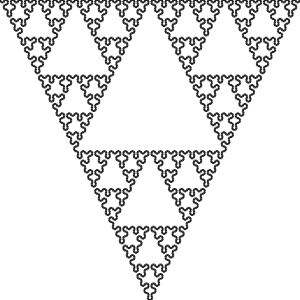

# Elm Introduction

## Values

```elm
number : Int
number = 5

greetings : String
greetings = "Hello World"
```

## Functions

```haskell
add : Int -> Int -> Int
add a b = a + b
```

## Tagged Unions

```elm
type Answer = Yes | No
```

. . .

```elm
type Name = HasName String | NoName
```

. . .

```elm
type Maybe a = Just a | Nothing
```

. . .

```elm
type Result error value = Ok value | Error error
```

## Records

```elm
type alias Player =
  { name : String
  , x : Float
  , y : Float
  , score : Int
  }
```

. . .

```elm
player1 : Player
player1 =
  { name = "Player 1"
  , x = 100
  , y = 100
  , score = 0
  }
```

. . .

```elm
player2 = Player "Player 2" 150 150 0
```

# Parser Combinators

---

Combine small parsers to larger ones until you can parse the whole data.

## Library

[Bogdanp/elm-combine](http://package.elm-lang.org/packages/Bogdanp/elm-combine/1.1.2/)

## Example

```elm
openParensParser : Parser String
openParensParser = string "("

closeParensParser : Parser String
closeParensParser = string ")"

intParser : Parser Int
intParser = int

intBetweenParens : Parser Int
intBetweenParens = between openParensParser closeParensParser intParser

parse intBetweenParens "(5)" == Ok 5
```

## Parsers

```elm
string : String -> Parser String
parse (string "Hello") "Hello World" == Ok "Hello"
```

. . .

```elm
char : Char -> Parser Char
parse (char 'H') "Hello World" == Ok 'H'
parse (char 'e') "Hello World" == Err ["expected 'e'"]
```

. . .

```elm
space : Parser Char
newline : Parser Char
lower : Parser Char
upper : Parser Char
```

## Combinators

### Map

```elm
map : (res -> res') -> Parser res -> Parser res'
parse (map String.toUpper (string "a")) "a" == Ok "A"

(<$>) : (res -> res') -> Parser res -> Parser res'
parse (String.toUpper <$> (string "a")) "a" == Ok "A"
```

---

### Between

```elm
between :  Parser left -> Parser right -> Parser res -> Parser res
parse (between (string "(") (string ")") (string "a")) "(a)" == Ok "a"
```

---

### Or

```elm
or : Parser res -> Parser res -> Parser res
parse (or (string "a") (string "b")) "b" == Ok "b"

(<|>) : Parser res -> Parser res -> Parser res
parse ((string "a") <|> (string "b") <|> (string "c")) "c" == Ok "c"
```

---

### Many and Many1

```elm
many : Parser res -> Parser (List res)
parse (many (char 'a'))) "aaa" == Ok ['a', 'a', 'a' ]
parse (many (char 'a'))) "aaa" == Ok []

many1 : Parser res -> Parser (List res)
parse (many1 (char 'a'))) "aaa" == Ok ['a', 'a', 'a' ]
parse (many1 (char 'a'))) "aaa" == Err [ "expected 'a'" ]
```

---

### SepBy

```elm
sepBy : Parser x -> Parser res -> Parser (List res)
parse (sepBy (char ',') int) "1,2,3" == Ok [1, 2, 3]
```

---

### `(*>)`

```elm
(*>) : Parser x -> Parser res -> Parser res
parse (char 'A' *> char 'B') "AB" == Ok 'B'
```

---

### map2, map3

```elm
type Model = Model Char Int

model = map2 Model upper int
parse model "N7" == Ok (Model 'N' 7)
```

---

# L-System

## Example

```elm
Angle = 60.0
Start = A
Rules =
A -> +B-A-B+
B -> -A+B+A-
```



## Expansion

```
Start = A
Rules =
A -> +B-A-B+
B -> -A+B+A-
```

```
A
```

. . .

```
+B-A-B+
```

. . .

```
+-A+B+A--+B-A-B+--A+B+A-+
```

## Expression

- Uppercase letter -> Constant - Draw a line
- Lowercase letter -> Variable - only use for expansion
- `-` -> turn left
- `+` -> turn right
- `[` -> push to the stack that remembers pos. and angle
- `]` -> pop from the stack

```elm
type Expression
    = Variable Char
    | Constant Char
    | TurnLeft
    | TurnRight
    | Push
    | Pop
```

## System

```elm
type Expression
    = Variable Char | Constant Char
    | TurnLeft | TurnRight
    | Push | Pop

type Premise = Premise (List Expression)
type Expansion = Expansion (List Expression)
type Rule = Rule Premise Expansion

type Angle = Angle Float
type alias System =
    { angle : Angle
    , start : List Expression
    , rules : List Rule
    }
```

## Parsing

```
Start = A
```

```elm
start = string "Start = " *> upper
parse start "Start = A" == Ok 'A'
```

---

```elm
start = string "Start = " *> (upper <|> lower)
parse start "Start = a" == Ok 'a'
```

---

```elm
variable = map Variable lower
constant = map Constant upper
start = string "Start = " *> (variable <|> constant)
parse start "Start = a" == Ok (Variable 'a')
parse start "Start = A" == Ok (Constant 'a')
```

---

```elm
variable = map Variable lower
constant = map Constant upper
start = string "Start = " *> many1 (variable <|> constant)
parse start "Start = aA" == Ok [Variable 'a', Constant 'A']
```
